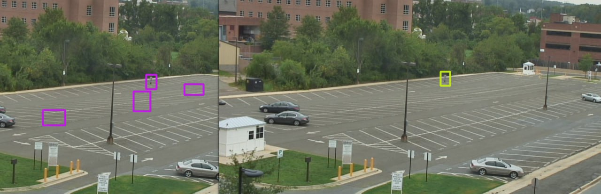
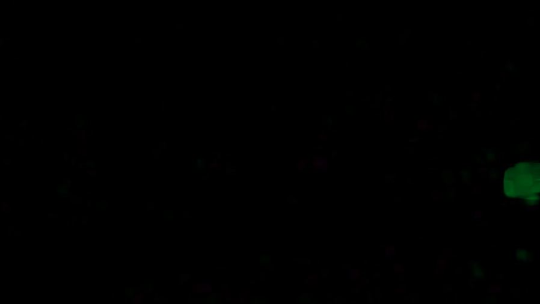
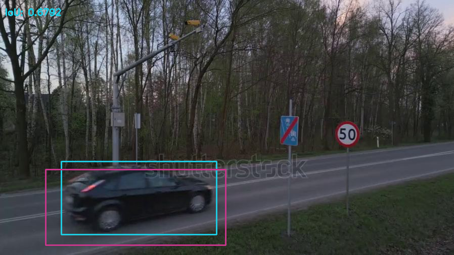

# LA-Motion-Detection

This is the project for Linear Algebra course based on the topic "Motion Detection with Optical Flow and PCA." The full report can be accessed by this link [Report](https://www.overleaf.com/read/bgwzhfxwcrth#dad3fc).

## Aim of the project

This project aims to implement an algorithm that integrates optical flow with principal component analysis (PCA) for efficient motion detection. The authors anticipate that this approach will address the issue of noisy motion segmentation, a common challenge with conventional methods such as Background Subtraction and Frame Differencing. Thus, the authors aim to demonstrate the benefits of using a PCA-based approach in addressing noisy motion segmentation while highlighting critical motion characteristics. A comparison will be made between implemented and built-in optical flow and the algorithm with and without integrated PCA to draw conclusions about the performance of the PCA-based algorithm in this area.

## Methodology

By tracking the flow of pixels over time, Optical Flow algorithms can construct a coherent narrative of movement within the scene, lending to a deeper understanding of object trajectories. However, it is prone to noise and may not effectively distinguish between actual object movement and random fluctuations. Therefore, to reduce the impact of noise, the aim is to integrate Principal Component Analysis (PCA). Using this algorithm, the optical flow can be decomposed into principal components, reducing their dimensionality and allowing us to focus on significant movements corresponding to actual objects.

Pipeline of the implementation includes the following steps:
- Preprocessing: Read and preprocess video frames (resize, grayscale conversion, etc.)
- Optical Flow Estimation with Farneback Algorithm: Implement and apply Gunnar Farneback's optical flow algorithm to estimate dense motion fields between consecutive frames.
- Principal Component Analysis (PCA): Perform PCA separately for each local window to capture motion patterns efficiently.
- Testing: Run some tests on different videos and techniques using Intersection over Union (IoU) method.

## Results & Comparison

### Integration of PCA

To demonstrate the results, we used a video shot by a static camera showing human movement. The image here shows a comparison between Optical Flow (on the left) and PCA-enhanced Optical Flow (on the right).

As a result of the optical flow, the detected pixels are highlighted in pink, showing false reminders on this video frame. In contrast, the use of PCA helps to remove false alarms in video especially with small moving objects. This comparison suggests that optical flow with PCA extension can improve the accuracy of object detection in such scenarios.

Furthermore, optical flow struggles with detecting objects near the edges of the image due to the specifics of motion estimation between frames. When PCA is applied to optical flow, it can enhance the detection of objects near the image edges. PCA effectively reduces the dimensionality of features and emphasizes the most relevant information. This improvement can enhance the overall accuracy of object detection, particularly in scenarios where objects are close to image boundaries. As shown in the figure, we observe a situation where the optical flow algorithm does not clearly detect motion at the edge, unlike when PCA is used.

### Convolution and FFT

The results shown in the images below compare the Convolution and Convolution with FFT implementations for ”boxing” the moving objects. For each approach, we calculated the IoU as the benchmark accuracy metric. Important to note that a threshold was chosen is 0.6. An actual conclusion cannot be made from the given results, but both methods work well. The moving object is detected; in some cases, the box is a bit bigger than the object, but it depends on the frame quality.

Convolution:

FFT based convolution:

